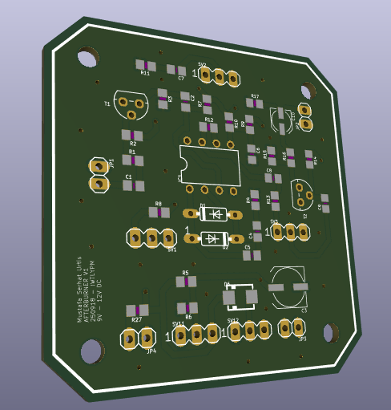
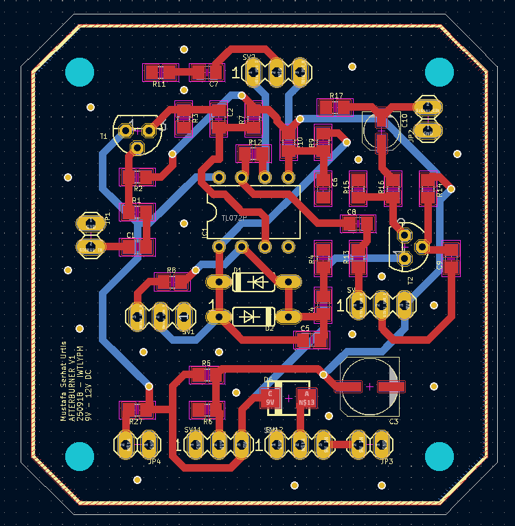

 

  

<h3 align="center">AFTERBURNER</h3>

  

    An Ibanez TS-9 Clone Board 
  

<!-- WHAT -->
## What?

This is an overdrive guitar effects board, "inspired" by the Ibanez Tube Screamer 9.

## Why?

I wanted to test the effects so that I can use them on another project. So I made standalone clone boards. This is one of them.

## How?

This is imported from Eagle to KiCad 6 while I was backing up my projects. So the schematic's look is a bit janky.

Diodes are used for clipping, can experiment with different combinations, LEDs etc.
